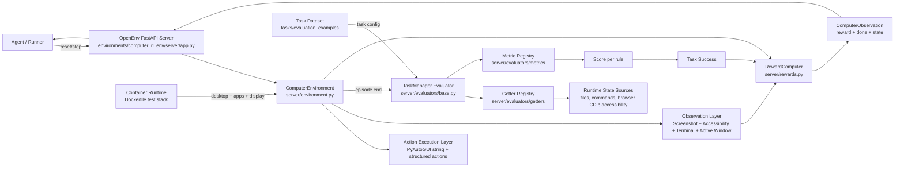

# Computer RL OpenEnv

OpenEnv-native desktop computer-use environment and evaluation stack, adapted from ComputerRL.

This repository provides:

- An OpenEnv-compatible Computer RL environment server
- Full task/evaluator/getter support for the OpenEnv task set
- Containerized runtime workflow via `Dockerfile.test`

## What this environment is

This project is a desktop GUI RL environment that exposes a computer session through an OpenEnv-style API.

It is designed for running and evaluating computer-use agents on real desktop workflows, including browser, office tools, file management, terminal tasks, and multi-app workflows.

At a high level, each episode provides observations (screenshot and UI state), accepts actions, and computes task success through getter + metric evaluators.

## Why it is useful

- Standardized benchmark execution: run the same task definitions repeatedly in a controlled containerized desktop.
- End-to-end agent validation: evaluate planning, action execution, and completion criteria on realistic GUI tasks.
- Reproducible runtime stack: use one image (`Dockerfile.test`) for desktop, browser, and OpenEnv server services.
- Modular evaluation pipeline: getters and metrics are composable, so task checks stay declarative in JSON.

## Dataset: ComputerRL `evaluation_examples`

Upstream dataset source:

- https://github.com/THUDM/ComputerRL/tree/main/evaluation_examples/

Dataset provenance:

- The ComputerRL `evaluation_examples` dataset is adapted from OSWorld: https://github.com/xlang-ai/OSWorld

What it contains:

- Task JSON files grouped by app/domain (Chrome, GIMP, LibreOffice, Thunderbird, VLC, VS Code, OS, multi-app).
- Natural-language instruction per task.
- Setup and post-setup steps for preparing desktop state.
- Evaluator definitions (getter configs + metric functions).
- Category-level registries that enumerate runnable task IDs.

How this repository uses it:

- The task set is mirrored under `environments/computer_rl_env/tasks/evaluation_examples/`.
- OpenEnv's `TaskManager` loads these task JSONs and executes setup/evaluation in-container.
- Getters collect runtime state (filesystem, command output, browser/app state), and metrics score success.
- This makes the benchmark directly runnable through the OpenEnv server/client interfaces in this repo.

Sync/update local task mirror from upstream:

- Run `python scripts/download_dataset.py --force` to download `THUDM/ComputerRL` `evaluation_examples/`
  and replace `environments/computer_rl_env/tasks/evaluation_examples/`.
- Optional flags: `--owner`, `--repo`, `--ref`, `--source-folder`, `--destination`.

## Repository layout

- `environments/computer_rl_env/`: OpenEnv environment package (client, models, server, tasks)
- `Dockerfile.test`: reproducible GUI + browser + app stack for local containerized runs

## Detailed package documentation

For full internals (server/controllers, getters, metrics, evaluators, VM provider, task schema, storage model, and extension points), see:

- [`environments/computer_rl_env/README.md`](environments/computer_rl_env/README.md)

## High-level design (HLD)



  ## Execution sequence (reset and step)

  ```mermaid
  sequenceDiagram
    participant U as Agent / Client
    participant S as FastAPI Server
    participant E as ComputerEnvironment
    participant T as TaskManager
    participant G as Getter Registry
    participant M as Metric Registry
    participant R as RewardComputer

    U->>S: POST /reset (task_config)
    S->>E: reset(task_config)
    E->>T: setup(task)
    T-->>E: setup complete
    E-->>S: initial observation
    S-->>U: observation

    loop each action
      U->>S: POST /step(action)
      S->>E: step(action)
      E->>E: execute action + capture observation

      alt action is DONE/FAIL or max steps reached
        E->>T: evaluate(task, elapsed_steps, last_action)
        T->>G: get_result(result/expected)
        G-->>T: runtime values
        T->>M: evaluate_metric(func, result, expected)
        M-->>T: metric score(s)
        T-->>E: success/final score
        E->>R: compute(success, step_count, prev_obs, curr_obs)
        R-->>E: reward
      else regular intermediate step
        E->>R: compute(False, step_count, prev_obs, curr_obs)
        R-->>E: step reward
      end

      E-->>S: observation (+ done/reward)
      S-->>U: step result
    end
  ```

## Prerequisites

- Linux host
- One container runtime:
  - Docker, or
  - Podman (rootless is supported)
- `uv` for local Python dependency sync

## Local development (without container)

From repository root:

```bash
uv sync --all-packages --dev
```

## `Dockerfile.test` setup

`Dockerfile.test` builds a full image with:

- Xvfb (`:99`) and XFCE desktop session
- VNC server on `5900`
- Chrome with CDP on `1337`
- OpenEnv app server on `8000` (Uvicorn)
- Supervisor-managed process stack

The image defines `start-test-stack`, which starts D-Bus, syncs workspace deps, and launches all services.

### 1) Build image

```bash
docker build -f Dockerfile.test -t computer-rl-env:openenv-runtime .
podman build -f Dockerfile.test -t computer-rl-env:openenv-runtime .
```

### 2) Start stack (detached)

```bash
docker run -d --name computer-rl-env-runtime \
  -p 8000:8000 \
  -p 1337:1337 \
  -p 5900:5900 \
  -v "$PWD":/workspace:Z \
  computer-rl-env:openenv-runtime start-test-stack

podman run -d --name computer-rl-env-runtime \
  -p 8000:8000 \
  -p 1337:1337 \
  -p 5900:5900 \
  -v "$PWD":/workspace:Z \
  computer-rl-env:openenv-runtime start-test-stack
```

Check logs:

```bash
docker logs -f computer-rl-env-runtime
podman logs -f computer-rl-env-runtime
```

### 3) Sync dependencies inside running container

This is useful after dependency or workspace edits:

```bash
docker exec -it computer-rl-env-runtime /bin/bash -lc 'cd /workspace && uv sync --frozen --all-packages --dev'
podman exec -it computer-rl-env-runtime /bin/bash -lc 'cd /workspace && uv sync --frozen --all-packages --dev'
```

### 4) Reload app after code-only changes

For edits under `environments/computer_rl_env/**`, you usually do not need to rebuild the image.

Restart only the app process:

```bash
docker exec computer-rl-env-runtime /bin/bash -lc 'supervisorctl -c /etc/supervisord-test.conf restart app'
podman exec computer-rl-env-runtime /bin/bash -lc 'supervisorctl -c /etc/supervisord-test.conf restart app'
```

Quick health check:

```bash
docker exec computer-rl-env-runtime /bin/bash -lc 'python - <<"PY"
import urllib.request
with urllib.request.urlopen("http://127.0.0.1:8000/health", timeout=5) as r:
    print(r.status)
PY'
```

### 5) Clean up container

```bash
docker stop computer-rl-env-runtime && docker rm computer-rl-env-runtime
podman stop computer-rl-env-runtime && podman rm computer-rl-env-runtime
```

### Rebuild guidance

Rebuild `computer-rl-env:openenv-runtime` when any of these change:

- `Dockerfile.test`
- `pyproject.toml`
- `uv.lock`
- package-level `pyproject.toml` files used in the image build

For code-only changes in mounted workspace paths, restart services instead of rebuilding.

## Environment usage

The environment package is under `environments/computer_rl_env`.

Minimal client example:

```python
from computer_rl_env import ComputerEnvClient, ComputerAction

client = ComputerEnvClient("http://localhost:8000")
obs = client.reset()

action = ComputerAction(action_type="click", x=500, y=500)
obs = client.step(action)

client.close()
```

## Evaluation and task coverage

- OpenEnv no-Google-Drive registry: 361 tasks
- OpenEnv full registry: 369 tasks
- Active task JSON coverage: all task-referenced getter and metric names resolve
- `infeasible` remains a dedicated special-case evaluation path, consistent with ComputerRL behavior