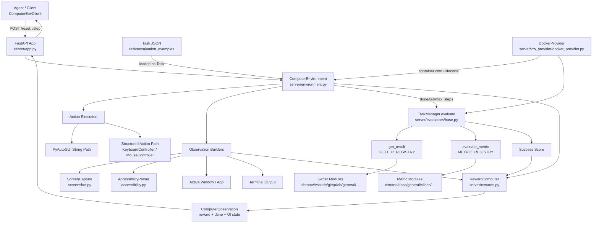

# computer_rl_env

OpenEnv-compatible desktop GUI environment package for ComputerRL-style tasks.

This package contains the full runtime stack for:

- desktop action execution,
- screenshot and accessibility observation,
- task setup and evaluation,
- getter/metric-based scoring,
- local and containerized server deployment.

## Build and run

### Build usage image (from repository root)

```bash
docker build -f environments/computer_rl_env/server/Dockerfile -t computer-rl-env:test .
```

### Run usage image

```bash
docker run --rm -it \
	-p 8000:8000 \
	-p 1337:1337 \
	-p 5900:5900 \
	computer-rl-env:test
```

### Run server without container

```bash
uv sync --all-packages --dev
uv run server
```

## API and client usage

```python
from computer_rl_env import ComputerEnvClient, ComputerAction

client = ComputerEnvClient("http://localhost:8000")
obs = client.reset()
obs = client.step(ComputerAction(action="pyautogui.click(x=500, y=500)"))
client.close()
```

Primary package exports are defined in `__init__.py`:

- `ComputerEnvClient`
- `ManagedComputerEnvClient`
- `ComputerAction`
- `ComputerObservation`
- `ComputerState`

## Architecture overview

Runtime flow:

1. FastAPI app is created by `server/app.py`.
2. OpenEnv routes call `ComputerEnvironment` (`server/environment.py`).
3. Environment executes an action (string PyAutoGUI or structured action model).
4. Controllers capture screenshot, accessibility tree, terminal output, active window/app.
5. On episode end (`DONE`, `FAIL`, or max steps), `TaskManager.evaluate()` computes success.
6. `RewardComputer` computes reward and the observation is returned.

## Mermaid diagram



## Source map (what each part does)

### Top-level package

- `client.py`: typed OpenEnv HTTP client implementation (`ComputerEnvClient`).
- `managed_client.py`: lifecycle client that starts/stops containerized env via `DockerProvider`.
- `models.py`: action/observation/state Pydantic models and structured action union.
- `openenv.yaml`: OpenEnv metadata (`app: server.app:create_app`, port 8000).

### Server

- `server/app.py`: app factory and custom endpoints.
- `server/environment.py`: main environment class and step/reset logic.
- `server/rewards.py`: sparse/shaped reward strategies.
- `server/start.sh`: container startup entrypoint (DBus, accessibility settings, supervisord).
- `server/supervisord.conf`: process orchestration (Xvfb, XFCE, VNC, Chrome CDP, Uvicorn app).
- `server/Dockerfile`: usage image build definition.

### Controllers (`server/controllers`)

- `screenshot.py`: grabs screen via `mss`, overlays cursor marker, returns base64 image.
- `accessibility.py`: parses AT-SPI tree to rich text and XML formats; includes terminal/window helpers.
- `recording.py`: ffmpeg-based start/stop screen recording.
- `keyboard.py`: keyboard primitives via `pyautogui`.
- `mouse.py`: mouse primitives via `pyautogui`.
- `utils.py`: `pyatspi` import/bootstrap helpers for venv + system dist-packages.

### Evaluators (`server/evaluators`)

- `base.py` (`TaskManager`): task setup, postconfig execution, metric orchestration.
- `getters/`: state extraction functions (files, commands, browser/app data, accessibility, etc.).
- `metrics/`: comparison/scoring functions used by evaluator definitions in task JSON.

### VM provider (`server/vm_provider`)

- `base.py`: provider interface.
- `docker_provider.py`: Docker/Podman-backed provider, container lifecycle, command execution.

### Tasks (`tasks`)

- `base.py`: `Task` and `EvaluatorConfig` schema.
- `loader.py`: loads single tasks and registry-driven task sets.
- `evaluation_examples/`: task dataset mirror used for setup/evaluation.

### Evaluation summaries

- `evaluation/metrics.py`: helper functions for aggregating episode results into reports.

## How `computer_rl_env` works end-to-end

### 1) Reset

`ComputerEnvironment.reset()`:

- initializes episode id and step counter,
- loads `task_config` into `Task` model,
- runs setup steps through `TaskManager.setup()`,
- captures initial observation fields,
- stores observation as `prev_observation`.

### 2) Action execution

`ComputerAction.action` supports:

- string commands: `pyautogui...` Python snippets,
- sentinel strings: `WAIT`, `DONE`, `FAIL`,
- structured typed actions (`move`, `click`, `type`, `press`, `hotkey`, `scroll`, `drag`, `wait`, `done`, `fail`).

Execution path:

- `_execute_action()` dispatches string vs structured,
- string path uses sandboxed `exec` with namespace `{pyautogui, time}`,
- structured path uses `KeyboardController` / `MouseController` methods,
- sentinel actions influence episode termination and evaluation behavior.

### 3) Observation generation

After each step, the environment builds `ComputerObservation` with:

- `screenshot_base64`
- `accessibility_tree` (text)
- `accessibility_tree_xml`
- `terminal_output`
- `active_window`, `active_app`
- `step_count`, `instruction`, `done`, `reward`

### 4) Evaluation and reward

If episode ends (`DONE`/`FAIL` or max steps):

- `TaskManager.evaluate()` runs evaluator `postconfig` steps,
- getter(s) compute `result` and `expected` values,
- metric(s) score each check,
- conjunction (`and`/`or`) combines metric scores,
- success boolean is passed to `RewardComputer`.

`RewardComputer` modes:

- `sparse`: success/failure reward minus step penalty,
- `shaped`: sparse reward + small progress bonuses (tree/window/app changes).

## Server endpoints

OpenEnv-provided environment routes (via `openenv_create_app`) include:

- `POST /reset`
- `POST /step`
- `GET /state`
- `GET /metadata`
- `GET /health`
- `GET /schema`
- `WS /ws`

Custom routes in `server/app.py`:

- `POST /setup/launch`: launch process command.
- `GET /screenshot`: raw screenshot bytes.
- `GET /terminal`: terminal output extracted from accessibility layer.
- `POST /start_recording`: begin ffmpeg recording.
- `POST /end_recording`: stop recording and return MP4 file.

## Task schema and storage

`Task` (`tasks/base.py`) stores:

- identity/instruction: `id`, `instruction`, `source`, `related_apps`,
- setup: `config`, `setup`, `proxy`, `fixed_ip`,
- evaluation: `evaluator.func/result/expected/options/postconfig/conj`,
- control metadata: `max_steps`, `timeout`, `metadata`, `category`, `difficulty`.

Task dataset files are stored under:

- `tasks/evaluation_examples/examples/...` (task JSON files by category)
- `tasks/evaluation_examples/test_nogdrive.json`
- `tasks/evaluation_examples/test_all.json`
- `tasks/evaluation_examples/test_small.json`

## Getter system

Registry entrypoint: `server/evaluators/getters/__init__.py`.

- `GETTER_REGISTRY` maps getter names to callables.
- `get_result(getter_type, env, config)` dispatches by registry name.
- unknown getters attempt fallback auto-discovery (`get_<name>`), then raise.

Getter module layout:

- `general.py`: command/rule/terminal primitives.
- `file.py`: VM/local/cloud file retrieval helpers.
- `info.py`: screen/window/wallpaper/list directory getters.
- `chrome.py`, `vscode.py`, `gimp.py`, `vlc.py`, `calc.py`, `impress.py`: app-specific data extraction.
- `misc.py`, `replay.py`: utility and replay-related getters.

## Metric system

Registry entrypoint: `server/evaluators/metrics/__init__.py`.

- `METRIC_REGISTRY` maps metric names to functions.
- `evaluate_metric(name, result=..., expected=..., **options)` adapts to positional calls
	so legacy metric signatures remain compatible.

Metric module layout:

- `general.py`: generic text/list/json/csv/sqlite/accessibility checks.
- `chrome.py`, `vscode.py`, `gimp.py`, `vlc.py`, `docs.py`, `slides.py`, `table.py`, `thunderbird.py`, `basic_os.py`, `libreoffice.py`, `others.py`, `pdf.py`: domain-specific evaluators.
- `app_launched.py`, `file_exists.py`, `process_running.py`, `text_present.py`, `url_match.py`: OpenEnv helper evaluators.

## Setup execution engine (TaskManager)

`TaskManager._execute_config_step()` supports setup/postconfig handlers such as:

- `sleep`, `launch`, `execute`, `execute_with_verification`
- `open`, `activate_window`, `close_window`
- `download`, `upload_file`, `create_file`
- `chrome_open_tabs`, `chrome_close_tabs`, `login`, `update_browse_history`
- `change_wallpaper`, `open_url`, `proxy`, `googledrive`

It also supports template variable replacement in command strings:

- `{CLIENT_PASSWORD}`
- `{SCREEN_WIDTH}`, `{SCREEN_HEIGHT}`
- `{SCREEN_WIDTH_HALF}`, `{SCREEN_HEIGHT_HALF}`

## VM provider and lifecycle

`DockerProvider` handles:

- container startup/shutdown,
- random host port allocation for app/CDP/VNC,
- health readiness polling against `/health`,
- in-container command execution,
- snapshot-like reset via container restart (`revert_to_snapshot`).

`ManagedComputerEnvClient` uses this provider to give a single interface that:

- starts container on connect,
- optionally recreates container between episodes,
- proxies reset/step calls to `ComputerEnvClient`.

## What stores what

Static repository data:

- task definitions: `tasks/evaluation_examples/**`
- app/server code: `server/**`
- package API/types: `client.py`, `models.py`, `managed_client.py`

Runtime in-memory state:

- environment state: `ComputerEnvironment.step_count`, `episode_id`, `current_task`, `prev_observation`
- task manager state: active task and observer list
- provider state: container handle and mapped ports

Runtime filesystem artifacts:

- setup command outputs cache: `/tmp/computer_rl_cache` (from `TaskManager`)
- recording output default: `/tmp/computer_rl_recording.mp4`
- container Chrome profile: `/root/chrome-profile`

Process-level runtime config:

- display: `DISPLAY=:99`
- DBus session socket: `/dev/shm/dbus_session_socket`

## Extending the package

### Add a new getter

1. Implement function in a getter module under `server/evaluators/getters/`.
2. Register name in `GETTER_REGISTRY`.
3. Reference getter type in task JSON `result`/`expected` configs.

### Add a new metric

1. Implement function in a metric module under `server/evaluators/metrics/`.
2. Register name in `METRIC_REGISTRY`.
3. Reference metric name in task JSON `evaluator.func`.

### Add a new setup step type

1. Add handler method in `TaskManager`.
2. Map `type` -> handler in `_execute_config_step()`.
3. Use the new `type` in task `config`/`postconfig`.

### Add a new action shape

1. Add Pydantic model in `models.py`.
2. Include it in `StructuredComputerAction` union.
3. Implement execution branch in `_execute_structured_action()`.